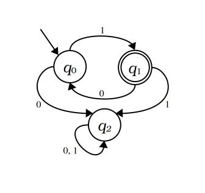
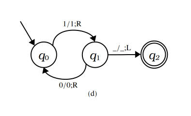

# Teaching Automata Theory with Clojure

This code was developed for the [Clojure/conj 2026](http://2026.clojure-conj.org/) presentation titled **“Teaching Automata Theory with Clojure”** which took place on October 2, 2026, at Charlotte, North Carolina. You can also check the presentation’s Google slides and YouTube video.

## Summary

Teaching the theory of computation often suffers from a disconnect between mathematical models and practical software engineering. This experience report details a classroom-tested approach refined over five years, showing how Clojure bridges that divide by enabling undergraduate CS students to build live, functional simulators for abstract machines, from basic regular expressions to finite automata and Turing machines. By shifting from dry, textbook theory to an experimental, data-driven methodology, this framework has dramatically enhanced engagement and deepened students’ architectural understanding of language semantics. Attendees will learn how Clojure’s core functional strengths turn intimidating theoretical concepts into tangible, executable code, leaving with a proven pedagogical blueprint that inspires and empowers the next generation of computer scientists and software developers.

## Sample Problem: Alternating Binary Language

Let $L$ be a language over the alphabet $\Sigma= \lbrace 0, 1 \rbrace$. For every string $w \in L$, $w$ must satisfy the following conditions:

* The first symbol must be $1$.
* The last symbol must be $1$.
* After any symbol $0$, the symbol $1$ must follow.
* After any symbol $1$ (provided it is not the last one), the symbol $0$ must follow.

Any string that does not satisfy the above conditions does not belong to $L$.

### Examples:
* *Belong to* $L$: $1$, $101$, $101010101$
* *Do not belong to* $L$: $\varepsilon$ (empty string), $0$, $01$, $1010$, $1001$, $101100101$

### Task

Provide solutions to recognize the language $L$ using each of the following formal models:

1. A Deterministic Finite Automaton (DFA)
2. A Regular Expression (regex)
3. A Context-Free Grammar (CFG)
4. A Turing Machine (TM)

Additionally, you must include the implementation of each solution along with **Clojure code** to programmatically verify that your models correctly accept valid strings and reject invalid ones, using the following approaches:

* For the regex, you must use Clojure’s native [regular expressions](https://clojuredocs.org/quickref#regular-expressions).
* For the CFG, you must use the [instaparse](https://github.com/Engelberg/instaparse) library.
* For the DFA and TM, you must build software simulators in Clojure.

### Solutions

#### 1. Deterministic Finite Automaton

<p align="center">
  
</p>

[Clojure code](src/clojure_conj_2026/dfa.clj).

#### 2. Regular Expression

$$
\texttt{1}(\texttt{01})*
$$

[Clojure code](src/clojure_conj_2026/regex.clj).

#### 3. Context-Free Grammar

$$
\begin{matrix}
A & \rightarrow & \texttt{1}\\
A & \rightarrow & \texttt{10} A \\
\end{matrix}
$$

[Clojure code](src/clojure_conj_2026/cfg.clj).

#### 4. Turing Machine

<p align="center">
  
</p>

[Clojure code](src/clojure_conj_2026/tm.clj).

#### 5. Bonus Functional Solution

```clojure
(defn alternating-binary?
  [input]
  (and (= \1 (first input) (last input))
       (apply = [\1 \0] (partition 2 input))))
```

[Clojure code](src/clojure_conj_2026/functional.clj).


